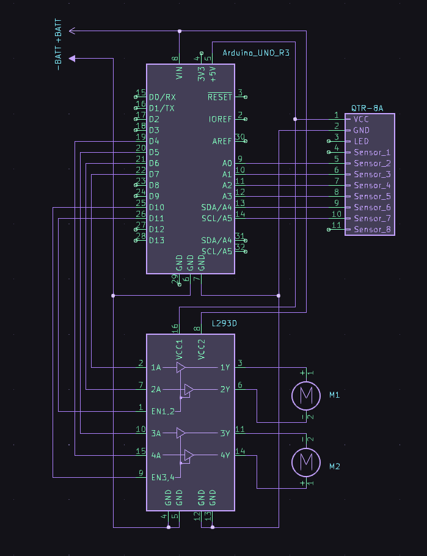
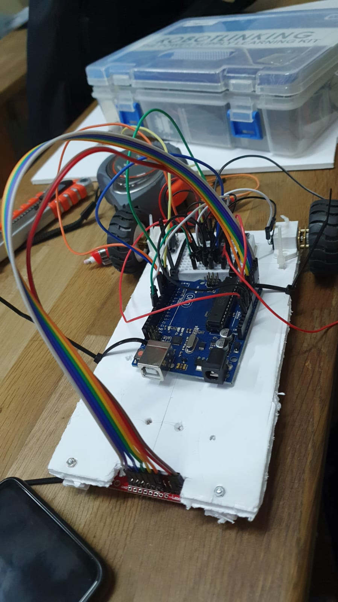
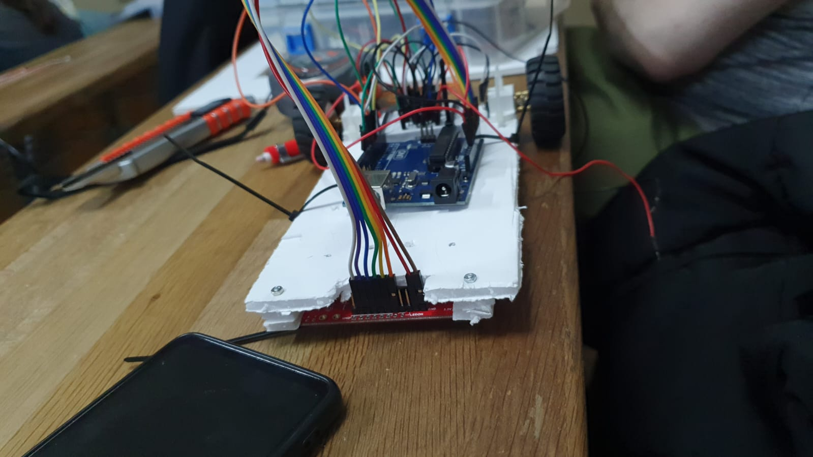

#                                                            Line-follower

* Team: George
* Students: Megherlich Andreea, Ursoiu Ioana, Belu Mihai
* Group: 364
* Robot Name: Dulap
  

## Technical Task
Assemble a robot that follows a black line using onboard sensors. Implement a PID (Proportional, Integral, Derivative) algorithm to ensure precise tracking of the line. Calibrate the sensors to distinguish the black line from the background. The robot should also autocalibrate in the beginning.

## Components
* Arduino Uno
* Zip-ties
* Power source (can be of different shape). In our case, a LiPo battery
* Wheels (2)
* Wires for the line sensor (female - male)
* QTR-8A reflectance sensor, along with screws
* Ball caster
* Extra wires 
* Chassis
* Breadboard - medium (400pts)
* L293D motor driver
* DC motors (2)

## Setup

### Initial Setup
Begin by assembling the chassis with the ball caster attached securely to ensure smooth movement. The initial position of the robot should be on the starting line of the track.

### Sensor Calibration
The line sensors must be calibrated accurately. Upon startup, the robot should enter a calibration mode. During this phase, the robot will automatically move slightly to calibrate its sensors against the contrasting colors of the line and the surface.

### Movement Mechanism
Utilize the attached motors to maneuver the robot. The robot's speed and direction are controlled by varying the voltage supplied to the motors through the L293D motor driver. Implement a function to set the motors' speed, allowing for forward and reverse movement.

### Line Following Logic
Implement a line-following algorithm using the calibrated sensors. The robot should continuously read the sensor values and adjust its course to follow the line. Implement PID control to make the movement smooth and responsive.

### Safety and Diagnostics: 
Ensure that all connections are secure to prevent any loose connections during operation. Include a diagnostic mode where the robot transmits its sensor readings and current state, aiding in troubleshooting and performance tuning.

## Schematic

## Setup Pictures
  

## Video
https://youtu.be/ACiChDZWwtw
